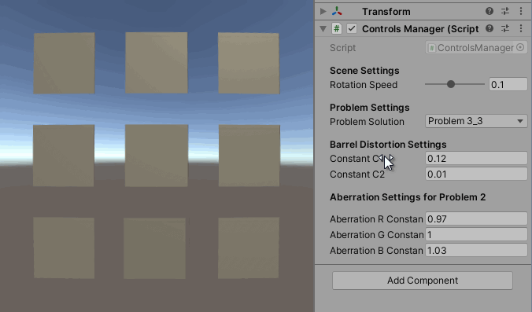
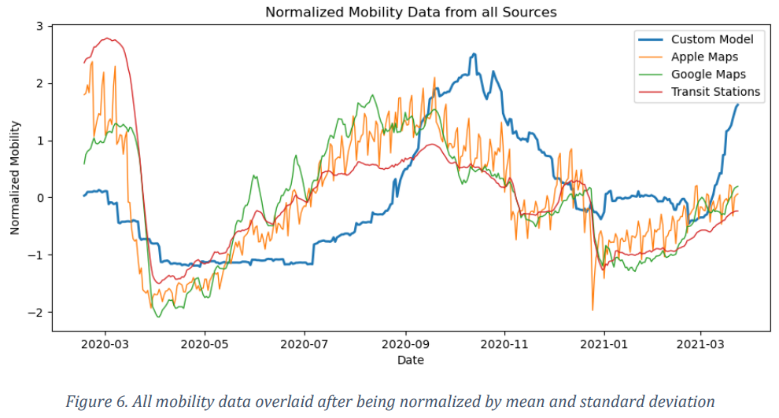

## Hi there 👋 I'm Tom, an aspiring Software and Machine Learning Engineer!

- Achieved 82% overall weighted average at uni. Highest weighted average was 83%.
- Highest mark in year 2 (Outstanding achievement award L2, £200 prize)

* ### Auto-Docking Spaceship PID Control System script (32,358 current users).
  > <p>
  > <a href="https://www.youtube.com/watch?v=Ogm4yzAaqEg">
  > 
  > </a>
  > </p>
  > 
  > <a href="https://steamcommunity.com/sharedfiles/filedetails/?id=2146371052"></a>
  > 
  > - Created a spaceship docking control system written in C# for players in *Space Engineers*, a space simulation game.
  > - At the time of writing, at least 32,358 users have downloaded the script to be used on their ships
  > - Watch a video of it in action here! https://www.youtube.com/watch?v=Ogm4yzAaqEg
  > - The script controls of all the thrusters and gyroscopes in order to perfectly land their ship. As part of this, I wrote a physics solver that can handle docking ships onto cruising ships, accelerating ships, rotating ships, ships in gravity, or all of the above.
  > - A large takeaway from this project was experiencing the *design, build, test, review* AGILE loop with real users: at peak usage of the script, there would be 15+ comments a day giving feedback, bugs and issues.
  > -  I would design a new feature, build a new update with the new feature, test it on a thorough testing world - a set of exhaustive simulation tests, then push the feature and adapt the project according to the responses.


* ## 4th Year Project: Using machine learning to identify motion of the camera within films (Achieved a First)
  > 
  > 
  > </a>
  > 
  > - The motion of a camera can reveal much about the director’s intention behind scenes in a movie. Automatic analysis of camera motion helps us understand what makes up the style of a scene, what gives directors their unique flair, and what makes some scenes so engaging.
  > - Typically, camera motion analysis techniques use models that capture simple elements such as linear translation or rotation about a subject, often with little temporal analysis. Datasets are usually small or contain a limited set of categories.
  > - The contributions of this paper are two-fold: 
  >   - First, a dataset creation pipeline is designed and evaluated, utilizing Structure-from-Motion techniques to allow for the easier creation of camera motion datasets.
  >   - Secondly, time-series machine learning methods are applied to a newly generated camera motion dataset in order to classify shots into more complex categories than previous works, obtaining high levels of accuracy - 83%.
  > - The following techniques were applied:
  >   - Films were cut into their individual scenes using a threshold detection system.
  >   - Optical flow analysis was performed in order to determine which scenes had a stationary camera and therefore should be removed.
  >   - Foreground-Background segmentation (with [Mask R-CNN](https://arxiv.org/abs/1703.06870)) was used to split moving objects from background camera motion.
  >   - [COLMAP](https://colmap.github.io/), a Structure-from-Motion (SfM) algorithm was used to extract the motion of the camera.
  >   - To improve the SfM algorithms results, a normalization and outlier-correction scheme was proposed and implemented, which greatly improved results.
  >   - Various machine learning techniques were applied: RNNs, GRUs, LSTMs and Bi-directional LSTMS, with different parameters tested in order to achieve the optimal results
  >   - Achieved an end-to-end accuracy of 85%, showing the benefits of this new technique.

* ## Pegasus Generation Deep Learning Project (78% Mark)
  > ### [PyTorch, Machine Learning]
  > - The task for the Deep Learning module was staged simply: Create an AI drawn picture of a pegasus (a winged horse), while only using the CIFAR-10 dataset. This dataset contains no pegasus pictures, meaning we had to rely on creative ways to manipulate machine learning programs.
  > - The resulting image of a pegasus I produced was used as examplar feedback to the class.
  > - To produce pegasus images, I applied a current state-of-the-art Generative Adversarial Network (GAN) and manipulated the architecture so that it recieved an extra label as an input when creating the image. This label was associated with how "bird-like" or how "horse-like" the output would be. The label was interpolated, producing images of various horse+bird configurations. Some of these configurations look like pegasus, judge for yourself!:
  > 
  > <p>
  > 
  > 
  > </p>
  > - Achieved a mark of 78%

* ## Reinforcement Learning Gravitar (79.4% Mark)
  > ### [PyTorch, Machine Learning, OpenAI Gym]
  > 
  > 
  > - We were tasked with creating a reinforcement learning agent that could achieve the highest score possible in the Atari game Gravitar - a notoriously difficult learning task.
  > - Using a state-of-the-art reinforcement learning model: a Deep Q Learning (DQN) agent with a [duelling architecture](https://arxiv.org/abs/1511.06581), I created an agent that showed competancy when aiming and shooting at enemies, and navigating basic elements of the terrain.
  > - In line with Reinforcement Learning theory, I also implemented a Prioritization Replay Buffer, N-Step return, Gradient Clipping, Reward Clipping, an Episodic life buffer (to end an episode when a life is lost), frame resizing to 84x84, Double-Q Learning, and Frame Stacking of 4 frames on top of each other.
  > - Experimentation showed convergence up to an average score of 300-320 after around 10k episodes of training.
  > - Achieved a mark of 79.4%


* ## Machine learning-powered search engine – Research placement with the British Library sponsored by Durham University
  > ### [Language Models, Flask, HTML, Javascript]
  > 
  > 
  > - Developed a Machine-Learning-powered search engine in an ESRC IAA Funded research placement with the British Library sponsored by Durham University.
  > - Created an advanced E-Thesis search engine by using a cutting-edge Transformer to semantically group each Thesis based upon their text content.
  > - Created a web-app using Flask and Javascript which demonstrated the ability to retrieve information which was more user relevant at a much faster rate from the E-Thesis database than previously possible.
  > - This web-app was tested by plant biologists at Kew Gardens. Their user feedback was used to to improve the tool and create a second iteration which included:
  >   - Automatic thesis web-scraping.
  >   - Searching for specific sentences within a dataset of theses.
  >   - Searching for sentences that are semantically similar to your search, with the [BERT Language Model](https://en.wikipedia.org/wiki/BERT_(language_model)).
  > - The tool was presented at the ESRC (Economic Social Research Council) Festival of Social Sciences

* ## Created the website for [Playtop UK](https://www.playtop.co.uk/)
  > ### [HTML/CSS, Javascript, Apache, PHP]
  > <a href="https://www.playtop.co.uk/"></a>
  > <a href="https://www.playtop.co.uk/"></a>
  > 
  > - Playtop is the worlds leading rubber safety surfacing provider. This website for the UK branch has been customer-facing for 2 years now.
  > - The website was written with Bespoke HTML with Wordpress compatibility to allow it to be editable by playtop employees. This meant:
  >   - Writing custom Wordpress elements from HTML/CSS to fit the design requirements.
  >   - Writing a custom Wordpress theme using HTML, CSS and Javascript.
  >   - Working together with Playtop in iterations in order to ensure their design brief was met.
  >   - Working in PHP with Playtop's Apache server to incorporate the changes.

* ## Banner animation design for [Jam](https://jamww.com/), with clients: *DavidMorris*, *Tradedesk*, *Trustpilot*, and *Checkout.com*
  > ### [HTML/CSS, Javascript]
  > 
  > 
  > 
  > 
  > 
  > 
  > 
  > 
  >
  > - Produced a total of 50 different HTML banner animations for [Jam](https://jamww.com/), a company that creates branded content for print, digital, social, TV and interactive channels.
  > - This work involved writing Javascript along with CSS in order to animate assets to match a descriptive brief and/or motion graphics example video.
  > - The banners are used as digital advertisements on websites, as such, had to be developed with full browser support and a minimal download size.

* ## Created *Hospital Dash*, a Game in Unity for Durham University (100% mark)
  > ### [C#, Unity, Cinema4D, Photoshop, Audacity]
  > 
  > 
  > 
  > - Fully designed and developed a game in Unity where you skate around with a very slidey hospital bed to deliver your patients to the correct location.
  > - This Masters coursework achieved a mark of 100%
  > - The highlights include:
  >   - Bed-physics simulation that is designed to be intuitive and fun to control
  >   - A soundtrack that seamlessly adapts to where you are in the map
  >   - 6 different power ups
  >   - Mini-map and map system
  >   - A points-based shop that provides various upgrades to your bed and hospital
  >   - 5 different levels
  >   - Non player character navigation around the map
  >   - Slippery floors and other obstacles

* ## Interactive vizualization of galaxies for public education, teaching concepts relating to telescopes (98% mark)
  > ### [Data Processing, Visualization Toolkit, Python]
  > <p>
  > 
  > </p>
    >
  > - Created in VTK (The Visualization Toolkit) - open source software which manipulates and displays scientific data in order to create interactive visualizations for educational purposes.
  > - Manipulating fake Hubble telescope data, demos were created to explain the concepts of: Redshift, aperture, focal length, optimal telescope wavelength, and how these variables effect telescope cost.
  > - To run in real-time, optimizations include:
  >    - Formatting the data into an easily parsable data-type
  >    - Instead of rendering a 3D volume, many 2D planes are rendered, each with an image texture applied
  >    - "Bucketing" galaxy depths so that many depths are represented by a single plane in the 3D volume
  > - This coursework achieved a mark of 98%.


* ## WebGL Room – Writing a Game Engine from Scratch (100% mark)
  > ### [WebGL, GLSL, Javascript, Node, HTML, Cinema4D, Blender, Photoshop]
  > 
  > 
  > 
  > - Created an interactive graphics demonstration, developed from the ground up using only WebGL - a low-level graphics API.
  > - Implemented the following graphical techniques from scratch:
  >   - Directional and point lighting
  >   - Phong Shading using the GLSL Shader language
  >   - Reading and displaying 3D models from .OBJ files
  >   - Real-time shadows
  >   - Normal Maps
  >   - Colour grading (using look up tables)
  >   - Height-based fog
  >   - Camera controls system
  >   - An Entity system, which includes an events system where entities can subscribe to an "events bus" to recieve updates.
  >   - An animation system that uses keyframes.
  > - Achieved 100% in the coursework.

* ## *Ready Recommenders* - A recommender system to suggest the perfect restaurant for a user (90% Mark)
  > ### [Data Processing, Python]
  > 
  > 
  >
  > - Created a recommender system that uses [data from Yelp](https://www.yelp.com/dataset) to suggest restaurants that a user may wish to visit based upon their previous reviews, comments, ratings, and personal data.
  > - A weighted ensemble technique was devised that combines both Collaborative filtering and Content-Based recommendation techniques. The ensemble weights were produced using Hyper-parameter tuning with a gaussian model to produce optimal performance from the recommender.
  > - Performed an ethics analysis of the recommender system to investigate how these kinds of systems can impact society and what biases they may have.
  > - Achieved a mark of 90% in the coursework.

* ## Improved text compression from 64.7% to 32.8% by using RNN text prediction (80% Mark)
  > ### [Tensorflow, Python]
  > - For this coursework, LaTeX (markup/formatting language) files were to be compressed into a zip file, beating the standard zip method (GNU zip) by producing a zip with a smaller file size.
  > - To beat the baseline, I decided to implement the _Burrows-Wheeler Transform_ and _Arithmetic Encoding_. The arithmetic encoding values were predicted by an _RNN_ (Recurrent Neural Network) combined with _Prediction by Partial Matching_.
  > - The demo below shows how the RNN has learned a large amount of LaTeX semantics; it can close opened brackets, can understand sentence structure, and can (usually) add correct punctuation.
  >   ```latex
  >   Experimental data on the space-time potential is the contribution of the
  >   $\ tanb $ decay of the string tensor in the following way, the differences
  >   are not necessarily smaller than $1.0\ textwidth
  >   \ begin { center }
  >   \ begin { picture }(120 ,100) (0 ,0)
  >   \put ( -1000 ,2000) {\ makebox (0 ,0) [r ]{1.5}}
  >   ```
  > - These realistic predictions allow for cutting-edge compression performance: compressing a LaTeX file to 32.8% of its original size, instead of 64.7% (which is the baseline standard).
  > - Achieved a mark of 80% in the coursework.

* ## *Beleaf City* – A highly optimized virtual world for the browser (100% mark)
  > ### [WebGL, ThreeJS, Javascript, Cinema4D]
  > 
  > 
  > 
  > 
  > - Produced a miniature city in a coursework that tested student's ability to optimize a virtual world for applications such as a browser and mobile phone.
  > - Optimizations and features included:
  >   - Custom written [progressive meshing](https://en.wikipedia.org/wiki/Progressive_meshes) algorithm that adds and reduces polygon detail where the main character walks.
  >   - A bending effect (vertex displacement) on the leaf surface as the character walks, to simulate a soft leaf.
  >   - A custom-written level of detail system to lower the quality of assets further away from the camera.
  >   - Rigged, skinned, and animated main character.
  >   - Smooth animation blending.
  >   - Depth of Field shader effect to imitate the characteristics of a real camera viewing a very small object.
  >   - Adaptive shadow resolution.
  > - Achieved 100% in the coursework.

* ## Explore Beaurepare Manor - a RESTful web-app group project (82% mark)
  > ### [AGILE, 3D Data Processing, Javascript, Node, MongoDB, ThreeJS, Python, ArcGIS, Photogrammetry]
  > 
  > 
  >
  > - Worked in a Software Engineering group using the AGILE methodology to launch a [RESTful](https://en.wikipedia.org/wiki/Representational_state_transfer) Web-App for a real client - the [Dream Heritage](https://dreamheritage.co.uk/) charity.
  > - Worked closely with Dream Heritage to produce a web-app that allowed visitors of the Beaurepare Manor ruins to learn about different areas of the Manor in an interactive 3D demo.
  > - My role in the team was to produce the 3D demo, this involved:
  >   - Processing LIDAR height map data into a 3D mesh using [ArcGIS](https://www.arcgis.com/home/index.html) and Python, 
  >   - Capturing higher detail versions of the parts of the ruins using photogrammetry to improve the quality of the model.
  >   - Generated a normal map (surface details) of the Manor using Adobe Sampler, an AI-based texture program.
  >   - UV mapping the 3D mesh with colour scans.
  >   - Cleaning up and optimising the model for use in a browser.
  >   - Programming in Javascript with ThreeJS to produce an interactive browser-based demo of the model with clickable zones of interest.
  > - As a team we achieved 82% in the coursework.

* ## Developed GPU shaders to distort a virtual world to be displayed in VR goggles (81% mark)
  > ### [HLSL, C#, Unity]
  > 
  > 
  > 
  > 
  > - When viewing virtual worlds through a VR headset, the lenses warp the world using pincushion distortion (see the image above). The inverse of this distortion must be applied on the image beforehand in order to create a normal experience for the viewer.
  > - Using the HLSL shader programming language, both vertex-based (more performant) and fragment-based (more accurate) methods for distorting the image were implemented, along with changeable parameters to correct for different lens shapes.
  > - Imperfect lenses also produce longitudinal and transverse chromatic aberration effects for the viewer. This was also corrected for in a pre-processing step by shifting RGB colours according to a procedure suggested by [Helferty et al](https://pubmed.ncbi.nlm.nih.gov/11465467/).
  > - This coursework achieved a mark of 81%.

* ## Tracking movement during the pandemic using Flickr photograph meta-data (76% mark)
  > ### [Data Processing, Selenium, Scrapy, Python]
  > 
  > 
  > 
  > - This project develops on an idea of mine for how to track mobility of a population throughout the pandemic - using photograph meta-data to track the effectiveness of lockdowns.
  > - Web-scraping techniques (Scrapy, Selenium) were used to extract the meta-data from photos uploaded onto [Flickr](https://www.flickr.com/). Most photos include a geotagged location in the meta-data.
  > - With the Flickr data, the movement of people were modelled as [Lévy flights](https://en.wikipedia.org/wiki/L%C3%A9vy_flight) combined with a [Hidden Markov Models](https://en.wikipedia.org/wiki/Hidden_Markov_model). The clustering algorithm [DBSCAN](https://en.wikipedia.org/wiki/DBSCAN) was used to group photographic locations that an individual photographer visited.
  > - As shown in the figure on the right, this modelling technique produced very similar results to the baselines from Apple Maps and Google Maps. This shows that the geotagged photographs method can be an effective tool for modelling the motion of a population.
  > - This coursework achieved a mark of 76%.

* ## Blockchain and Cryptography - Writing Ethereum smart contracts (72% mark)
  > ### [Solidity, Python]
  > 
  > 
  > 
  > 
  > - The first part of this coursework involved writing our own blockchain example in Python from scratch. I successfully wrote my own accounts-based ledger which included a fully cryptographically secure transaction system along with Proof of Work block mining.
  > - The second part of the coursework involved writing a smart contract for the Ethereum blockchain. My smart contract could be deployed by a teacher and used to track and mark exam submissions.
  > - Due to the decentralized nature of the smart contract, it would be almost impossible for a student to hack into the submission system and change their work or their mark without the teacher's private cryptographic key.
  > - The smart contract was successfully deployed and tested on the [Ropsten](https://ethereum.org/en/developers/docs/networks/) network using Ganache and MetaMask.
  > - This coursework received a mark of 72%.

* ## "Realify" GTA 5 Graphics - An exercise in machine learning with a small dataset (85%  mark)
  > ### [PyTorch, Image Processing, Python]
  > 
  > 
  > 
  > 
  > - For this machine learning coursework, we were tested on our ability to squeeze every crumb from a small dataset - the dataset being a few minutes of example video from an old movie.
  > - We were tasked with taking footage from the game GTA 5 and changing it's style to look realistic, like the example video. After some research, I implemented the cutting-edge CycleGAN architecture which could transfer the style from one video onto another.
  > -  The lecturer knew the data quantity wasn't enough to teach a model such as a CycleGAN, leading us to into a fascinating problem solving exercise. I solved the problem the following ways:
  >       - Used pose estimation ([OpenPose](https://github.com/CMU-Perceptual-Computing-Lab/openpose)) to predict what pose each person was in. Different CycleGANs were trained as experts on each specific pose.
  >       - [Mask-RCNN](https://github.com/matterport/Mask_RCNN) was used to extract the masks of each person. The different CycleGANs were trained on these masks.
  >       - Combined "realified" GTA 5 masks with a "realified" background in order to produce a final image.
  >       - Additionally, the data was augmented by flipping, cropping, varying the brightness, changing the saturation, and changing the aspect ratio of each frame.
  > - This coursework achieved a mark of 85%.

* ## Stance Detection (78% mark)
  > 
  > 
  > 
  > - Within the context of detecting fake news, this project looks to estimate the relative stance of an article relating to a headline, useful for understanding how different news organisations perceive a certain topic. These articles may agree, disagrees, discuss, or be unrelated to the headline.
  > - Multiple cutting edge transformers and techniques were combined to form an advanced language model pipeline:
  >   1. Articles and headlines were first classified into related/unrelated by using Google's BERT language model. The model outputs a representation of the relationship between the texts.
  >   2.  A bi-directional Gated Recurrent Unit (GRU) network is then applied on these representations to produce a related/unrelated classification.
  >   3.  Once articles are detected as "related", RoBERTa, a second language model is used to classify into agree/disagree/discuss. RoBERTa is a latest advancement on BERT, providing better performance in this case.
  > -  These models and this architecture was chosen as a result of testing various models and configurations. The final end-to-end metrics are shown below:
  > 
  > 
  > - The end-to-end accuracy was close to winners of the already over [Fake News Challenge](http://www.fakenewschallenge.org/) competition, achieving a slightly higher accuracy than the second-place model which obtained an accuracy of 92% on the test data.
  > - This coursework achieved a mark of 78%.

* ## Highly optimizing a particle simulation for a supercomputer in C – 84% mark
  > 
  > 
  > - Created a highly optimized particle gravity simulation that was scalable, fast, and executable on *Hamilton*, Durham University's supercomputer.
  > - Implemented techniques such as: SIMD Vectorization, CPU Parallelization and various mathematical and algorithmic optimizations in order to obtain one of the fastest speeds in the class.
  > - Tested on up to 56 CPU cores in parallel to ensure close-to-linear speed scaling.
  > - Achieved a mark of 84%.

* ## Wrote simple Neural Network library from scratch at the age of 15
  > 
  > 
  > 
  > 
  > - Made when I was 15, and to prove to another student I could, I created a neural network library that was capable of different activities such as binary classification, graph approximation and simple number and character recognition.
  > - Improved upon in the future to create a system that could drive a toy car around by using an estimated depth map from a webcam.
  > - At this age, I was unaware of the MNIST dataset and data augmentation methods, so I "invented" my own image transformations in order to augment my pwn dataset.
  > - While at school I was captivated by projects, creating at least 20 other projects that, if shown here, would extend the list outside of anyone's attention span.
